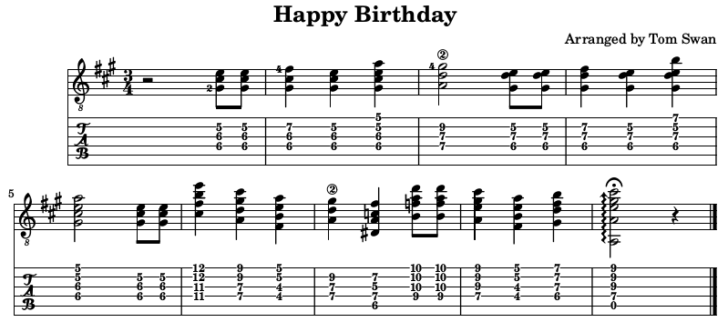

// README.adoc

= Why I Love Lilypond

When it comes to creating good-looking sheet music scores, Lilypond scores a 10 out of 10 from me. It's my top choice for engraving guitar scores, complete with fingerings and tablature plus whatever other musical markings I could possibly ever need. 

Here's a sample of Lilypond's output -- a short chord melody of Happy Birthday for guitar that I whipped up for this article.

Here's a recording of me playing the score:

// -----------------------------------------------------------------

== Continue reading...

https://www.tomswan.com/articles/why-i-love-lilypond.html

- - -

// -----------------------------------------------------------------

== Using the Files

Read the full article for an introduction to Lilypond text markup, plus get the full score for my rendition of Happy Birthday. 

Or, download or clone the repository if you want everything, including the published article's AsciiDoc source files. You can also extract PDF and other files directly from the GitHub repo. Everything is here.

- - -

// -----------------------------------------------------------------

== More Information

For more stuff, browse my repositories on GitHub. It's where I store all of my downloads, files and example programs, new and old. Everything is free for the taking. 

Please also follow the links below to visit my web site and YouTube channel. Write to me at tom@tomswan.com. Good luck!

Website: https://www.tomswan.com

GitHub: https://github.com/TomSwan

YouTube: https://www.youtube.com/user/TomSwanPlaysGuitar
